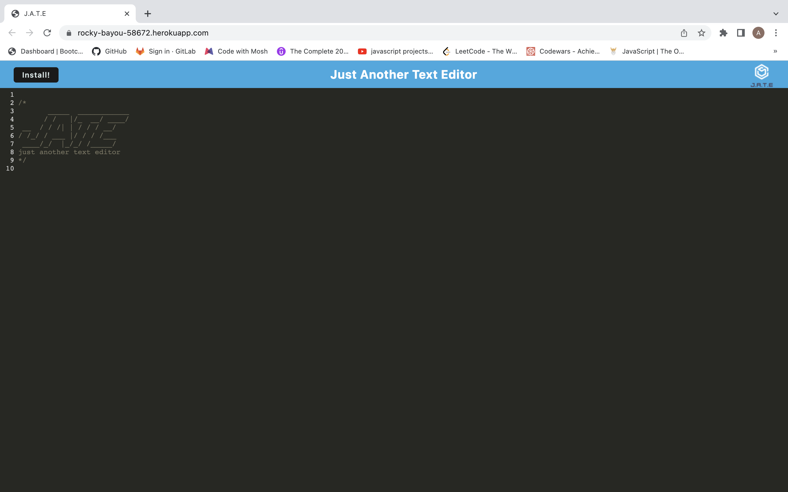

# Text-Editor

## Table of contents:

- [Description](#description)
- [Installation](#installation-and-Usage)
- [Contributors](#contributors)
- [Questions](#questions)

### Description:

This is a single-page PWA application that runs in the browser. This is a text editor that saves data in a IndexedDB database and has the capability to run offline.

screenshots of running program: 

### Installation and Usage:

Clone my repo and npm install

### License:

This project is licensed under: MIT

### Contributors:

Abdirahman

### Questions:

If you have any questions contact Abdirahman on [Github](https://github.com/aden-abdirahman)
or [Email](https://aden.abdirahman45@gmail.com)

Link to deployed site: [Link](https://rocky-bayou-58672.herokuapp.com/)
